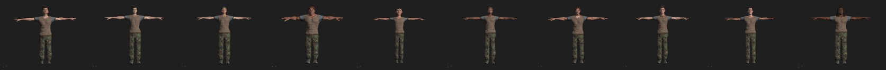
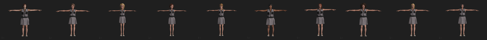

# Benchmarking Dataset for Human Motion Retargeting

# Introduction
Human Motion Retargeting, abbreviated as HMR, is a benchmarking dataset for human motion retargeting and human video generation. The dataset is a synthesized dataset based on Adobe Fuse CC, [Blender](https://www.blender.org/) and [Mixamo](https://www.mixamo.com). HMR dataset contains around 800 videos of 20 different female and male characters with different up-clothes and bottom-clothes. Since we can control the body shape and ratio while constructing the characters, it is quite easy to obtain different videos with the same character identity but different body shape, such as height of the person. The details of the HMR dataset is summarized below.

| HMR |female|male|up-cloths|bottom-clothes|videos|images|animation|
|:--:|:--:|:--:|:--:|:--:|:--:|:--:|:--:|
|Total| 10 | 10 | 10 | 10 | 816 | 133652| 292|

Different from previous datasets, we provide continuous videos rather than single image. The clothes of the person is also given in our dataset. Therefore, HMR dataset can be used as a benchmarking dataset for different computer vision tasks:
- Pose transfer or motion retargeting
- Virtual try-on under the same or different poses
- Human video generation

# Datasets
## Characters
The dataset is consist of 10 males and 10 females. The visualization examples are shown bellow:
 

## Clothes
We contruct 10 combinations of different upper-clothes and bottom-clothes selected from [clothes].(./figures/clothes).
## Animations
The animations examples are applied from [Mixamo](https://www.mixamo.com). Around 300 animations are included in our datasets, and cover a wide spectrum of motions in daily life, such as dance, walk, jump, etc.

# Downloads
The HMR dataset is provided in [Google Drive](). If you have some qustions, please contact jiahangwangchn@gmail.com.

# Citation